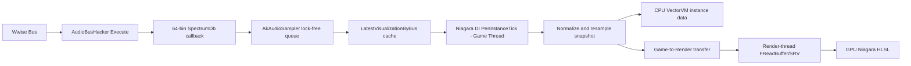

# NiagaraDataInterfaceAkWwiseSpectrum 实施方案与实现记录

> 实现状态：已完成 UE5.7 的 UHT、C++ 编译和模块链接验证。Niagara 资产级 CPU/GPU
> 运行效果仍需在目标工程中使用实际 Wwise Bus 音频验证。

## 1. 目标

在 `AkAudioSampler` 模块内新增 Niagara Data Interface：

```cpp
UNiagaraDataInterfaceAkWwiseSpectrum
```

该 Data Interface 从 `UAkAudioSampler` 已缓存的
`FAkAudioBusHackerVisualizationData` 中读取 Wwise Bus 频谱，使 Niagara CPU Simulation
和 GPU Compute Simulation 都能按照 UE5.7 `UNiagaraDataInterfaceAudioSpectrum` 的使用方式采样音频频谱。

本方案不在 Unreal Engine 中重新执行 FFT。AudioBusHacker 已经在 Wwise 音频线程生成
64 个对数分布的频谱 bin，Data Interface 只负责：

1. 选择目标 Wwise Bus；
2. 将 dBFS 频谱映射到 Niagara 使用的幅度范围；
3. 按配置的频率范围和输出分辨率重采样；
4. 为 Niagara CPU VM 提供只读快照；
5. 将同一份快照上传到 GPU Buffer，并生成 Niagara HLSL 采样函数。

## 2. 参考与现状

### 2.1 UE5.7 参考实现

参考文件：

- `H:/UE5/UE_5.7/Engine/Plugins/FX/Niagara/Source/Niagara/Classes/NiagaraDataInterfaceAudioSpectrum.h`
- `H:/UE5/UE_5.7/Engine/Plugins/FX/Niagara/Source/Niagara/Private/NiagaraDataInterfaceAudioSpectrum.cpp`

需要复用的 UE5.7 模式包括：

- `UCLASS(EditInlineNew)` Data Interface 类型注册；
- `GetFunctionsInternal()` 声明 Niagara 函数；
- `GetVMExternalFunction()` 绑定 CPU VectorVM 函数；
- `AppendCompileHash()`、`GetParameterDefinitionHLSL()` 和 `GetFunctionHLSL()`；
- `BuildShaderParameters()` 和 `SetShaderParameters()`；
- `FNiagaraDataInterfaceProxy` 持有渲染线程资源；
- `FReadBuffer`/SRV 向 GPU Niagara 提供只读频谱。

UE5.7 已将旧的 `GetFunctions()` 标记为弃用，因此新类必须实现：

```cpp
#if WITH_EDITORONLY_DATA
virtual void GetFunctionsInternal(TArray<FNiagaraFunctionSignature>& OutFunctions) const override;
#endif
```

### 2.2 AkAudioSampler 当前数据

`FAkAudioBusHackerVisualizationData` 已提供：

- `Sequence`：每个 AudioBusHacker 实例递增的快照序号；
- `BusName`：查询时使用的 Bus 名称；
- `SpectrumMinHz` / `SpectrumMaxHz`；
- `SpectrumDb`：64 个对数分布频点，单位 dBFS；
- `SpectrumFrequenciesHz`：对应频率；
- `ChannelPeakDb` / `ChannelRmsDb`；
- `NumChannels` / `AnalyzedChannels`；
- `StereoCorrelation` 和 `DownstreamGain`。

AudioBusHacker 当前约以 25 Hz 发布一次快照。Niagara 可以按 60 Hz 或更高频率运行，
但在两个 Wwise 快照之间应保持最近一次有效数据，不重复执行频谱转换。

### 2.3 与 UE Audio Spectrum 的差异

| 项目 | UE `AudioSpectrum` | `AkWwiseSpectrum` |
| --- | --- | --- |
| 音频来源 | Unreal Submix | Wwise Bus + AudioBusHacker |
| 频谱计算 | UE 内 FFT/CQT | Wwise 插件内 1024 帧 Hann + 64 个 Goertzel 频点 |
| 源频谱布局 | 每声道 | 所分析声道混合后的单路频谱 |
| 源更新率 | 取决于 UE 音频缓冲 | 约 25 Hz |
| CPU Niagara | 支持 | 已实现 |
| GPU Niagara | 支持 | 已实现 |

AudioBusHacker 只有一份混合频谱，因此本 Data Interface 的 `GetNumChannels()` 返回 1，
`ChannelIndex != 0` 时 `AudioSpectrum()` 返回 0。`ChannelPeakDb` 和 `ChannelRmsDb`
仍然是分声道数据，但不在第一版 Spectrum Data Interface 的接口范围内。

## 3. 总体架构



关键约束：

- Wwise 音频线程只负责现有固定大小数据复制和无锁入队；
- Niagara 不从 Wwise 音频线程调用 UObject、RHI 或 Niagara API；
- 频谱读取和重采样只在 Niagara `PerInstanceTick()` 中执行一次，不在每个粒子上执行；
- CPU VM 与 GPU Shader 采样同一份已重采样数据，确保结果一致；
- GPU Buffer 的创建、释放和更新只发生在渲染线程。

## 4. 新增类型与文件

在 `AkPlugins/AkAudioSampler` 中新增：

```text
Public/NiagaraDataInterfaceAkWwiseSpectrum.h
Private/NiagaraDataInterfaceAkWwiseSpectrum.cpp
```

类声明建议：

```cpp
UCLASS(
    EditInlineNew,
    Category = "Wwise Audio",
    CollapseCategories,
    meta = (DisplayName = "Ak Wwise Spectrum"))
class AKAUDIOSAMPLER_API UNiagaraDataInterfaceAkWwiseSpectrum
    : public UNiagaraDataInterface
{
    GENERATED_BODY()
};
```

不继承 `UNiagaraDataInterfaceAudioSubmix`。该基类负责 Unreal Audio Mixer/Submix 监听，
与 Wwise 数据来源无关，继承它会引入无效的 Submix 属性和音频监听生命周期。

## 5. 编辑器参数

建议暴露以下属性：

```cpp
UPROPERTY(EditAnywhere, Category = "Wwise")
FString BusName = TEXT("Master Audio Bus");

UPROPERTY(EditAnywhere, Category = "Spectrum", meta = (ClampMin = "16", ClampMax = "1024"))
int32 Resolution = 64;

UPROPERTY(EditAnywhere, Category = "Spectrum", meta = (ClampMin = "20.0", ClampMax = "20000.0"))
float MinimumFrequency = 20.0f;

UPROPERTY(EditAnywhere, Category = "Spectrum", meta = (ClampMin = "20.0", ClampMax = "20000.0"))
float MaximumFrequency = 20000.0f;

UPROPERTY(EditAnywhere, AdvancedDisplay, Category = "Spectrum", meta = (ClampMin = "-120.0", ClampMax = "0.0"))
float NoiseFloorDb = -60.0f;

UPROPERTY(EditAnywhere, AdvancedDisplay, Category = "Wwise")
bool bAutoRegisterVisualizationCallback = true;

UPROPERTY(EditAnywhere, AdvancedDisplay, Category = "Spectrum", meta = (ClampMin = "0.0"))
float StaleDataTimeoutSeconds = 0.25f;
```

参数语义：

- `BusName` 必须与插入 AudioBusHacker 的 Wwise Bus 名称一致；
- `Resolution` 默认 64，与源数据一致；设置为更大值只会插值，不会增加真实频率精度；
- `MinimumFrequency` 和 `MaximumFrequency` 定义 Niagara 归一化位置 0 到 1 的频率范围；
- `NoiseFloorDb` 映射为 Niagara 幅度 0；0 dBFS 映射为 1；
- `StaleDataTimeoutSeconds` 到期后输出清零，防止音频停止后粒子永久保持最后一帧；
- `bAutoRegisterVisualizationCallback` 默认启用，使 Niagara DI 不依赖外部蓝图注册。

属性必须在 `Equals()` 和 `CopyToInternal()` 中完整比较与复制。编辑器修改
`Resolution`、频率范围或 Noise Floor 后，即使 Wwise `Sequence` 未变化，也必须重新处理最近快照。

## 6. Niagara 函数接口

### 6.1 必需接口

与 UE5.7 `AudioSpectrum` 保持相同的主要调用形式：

```text
AudioSpectrum(
    float NormalizedPositionInSpectrum,
    int ChannelIndex
) -> float Amplitude

GetNumChannels() -> int NumChannels
```

行为：

- `NormalizedPositionInSpectrum` 被限制到 `[0, 1]`；
- 0 对应 `MinimumFrequency`，1 对应 `MaximumFrequency`；
- 相邻输出 bin 之间使用线性插值；
- 无有效快照、Bus 不匹配或 `ChannelIndex != 0` 时返回 0；
- 有有效频谱时 `GetNumChannels()` 返回 1，否则返回 0。

### 6.2 推荐诊断接口

增加一个轻量接口，便于 Niagara 脚本区分“静音”和“尚未收到数据”：

```text
IsSpectrumValid() -> bool IsValid
```

三个签名都设置：

```cpp
Signature.bMemberFunction = true;
Signature.bRequiresContext = false;
Signature.bSupportsCPU = true;
Signature.bSupportsGPU = true;
```

## 7. 频谱转换

### 7.1 dBFS 归一化

AudioBusHacker 已返回幅度 dBFS，不再执行 `log10`。对源 dB 值使用：

```text
clampedDb = max(sourceDb, NoiseFloorDb)
amplitude = (clampedDb - NoiseFloorDb) / max(1, -NoiseFloorDb)
```

这与 UE Audio Spectrum 的 Noise Floor 语义一致：

- `sourceDb <= NoiseFloorDb` 输出 0；
- `sourceDb == 0` 输出 1；
- 大于 0 dBFS 的值允许略大于 1，与 UE 接口说明一致；
- 不应用 `DownstreamGain`，结果表示 AudioBusHacker 插入点实际分析到的信号。

### 7.2 频率范围与重采样

AudioBusHacker 源频点本身已经对数分布：

```text
sourceFrequency(i) = SourceMinHz * pow(SourceMaxHz / SourceMinHz, i / 63)
```

输出第 `i` 个 bin 的目标频率：

```text
p = i / (Resolution - 1)
targetFrequency = MinimumFrequency * pow(MaximumFrequency / MinimumFrequency, p)
```

再将目标频率映射回源频谱位置：

```text
sourcePosition = log(targetFrequency / SourceMinHz)
               / log(SourceMaxHz / SourceMinHz)
               * (SourceBinCount - 1)
```

对 `sourcePosition` 的相邻 bin 线性插值。目标频率位于源频率范围之外时输出 0，
不能钳制到首尾 bin，否则会在 Nyquist 以上产生错误的平台值。

以下异常输入统一输出零缓冲：

- 源数组为空或少于 2 个 bin；
- `SourceMinHz <= 0`；
- `SourceMaxHz <= SourceMinHz`；
- 配置的 `MaximumFrequency <= MinimumFrequency`；
- Bus 查询失败或快照超时。

## 8. 每实例数据与 CPU 路径

### 8.1 Game Thread 实例数据

建议定义：

```cpp
struct FInstanceData_GameThread
{
    TArray<float> Spectrum;
    FAkAudioBusHackerVisualizationData LastSnapshot;
    int64 LastSequence = INDEX_NONE;
    uint32 LastSettingsHash = 0;
    float SecondsSinceLastSnapshot = 0.0f;
    bool bHasValidData = false;
    bool bRenderDataDirty = true;
    bool bOwnsVisualizationRegistration = false;
};
```

实现以下 UE5.7 生命周期接口：

```cpp
InitPerInstanceData()
DestroyPerInstanceData()
PerInstanceDataSize()
HasPreSimulateTick() const { return true; }
PerInstanceTick()
```

`PerInstanceTick()` 流程：

1. 使用 `BusName` 调用 `UAkAudioSampler::GetLatestVisualizationData()`；
2. 比较 `Sequence` 和参数哈希；
3. 只有数据或参数变化时才执行重采样；
4. 新快照到达时重置超时计时；
5. 超时后将缓冲清零并标记无效；
6. 仅在缓冲实际变化时设置 `bRenderDataDirty`。

CPU VectorVM 函数通过：

```cpp
VectorVM::FUserPtrHandler<FInstanceData_GameThread>
```

读取每实例缓冲。禁止在每个粒子的 `AudioSpectrum()` 调用中查询 AkAudioSampler 或重采样，
否则粒子数量会直接放大锁竞争和计算成本。

## 9. GPU 路径

### 9.1 Game-to-Render 数据

定义 16 字节对齐的传输结构：

```cpp
struct alignas(16) FInstanceData_GameToRender
{
    TArray<float> Spectrum;
    int32 Resolution = 0;
    int32 NumChannels = 0;
    uint32 bHasValidData = 0;
    uint32 bUpdateSpectrum = 0;
};
```

实现：

```cpp
ProvidePerInstanceDataForRenderThread()
```

仅当 `bRenderDataDirty` 时复制数组。`PerInstanceDataPassedToRenderThreadSize()` 由 Proxy
返回 `sizeof(FInstanceData_GameToRender)`，并用 `static_assert` 验证大小满足 16 字节对齐要求。

### 9.2 Render Thread Proxy

```cpp
struct FInstanceData_RenderThread
{
    FReadBuffer SpectrumBuffer;
    int32 Resolution = 0;
    int32 NumChannels = 0;
    bool bHasValidData = false;
};

struct FNiagaraDataInterfaceProxyAkWwiseSpectrum
    : public FNiagaraDataInterfaceProxy
{
    TMap<FNiagaraSystemInstanceID, FInstanceData_RenderThread> PerInstanceData;
};
```

Proxy 实现：

- `ConsumePerInstanceDataFromGameThread()`：必要时重建 `PF_R32_FLOAT` Buffer 并上传；
- `PerInstanceDataPassedToRenderThreadSize()`；
- 删除 System Instance 时必须在渲染线程释放 `FReadBuffer` 后再从 Map 移除；
- 空数据也保留至少一个零值元素，确保 Shader 始终绑定合法 SRV。

`DestroyPerInstanceData()` 通过 `ENQUEUE_RENDER_COMMAND` 清理对应
`FNiagaraSystemInstanceID` 的渲染线程数据。

### 9.3 Shader 参数

```cpp
BEGIN_SHADER_PARAMETER_STRUCT(FShaderParameters, )
    SHADER_PARAMETER(int32, NumChannels)
    SHADER_PARAMETER(int32, Resolution)
    SHADER_PARAMETER(int32, HasValidData)
    SHADER_PARAMETER_SRV(Buffer<float>, SpectrumBuffer)
END_SHADER_PARAMETER_STRUCT()
```

实现：

- `AppendCompileHash()`；
- `GetParameterDefinitionHLSL()`；
- `GetFunctionHLSL()`；
- `BuildShaderParameters()`；
- `SetShaderParameters()`。

`SetShaderParameters()` 使用 `Context.GetSystemInstanceID()` 查找对应 Buffer，并使用
`FNiagaraRenderer::GetSrvOrDefaultFloat()` 提供安全的默认 SRV，不能假定 RT Map 中一定已有实例。

HLSL 的核心采样逻辑：

```hlsl
if (HasValidData == 0 || In_ChannelIndex != 0 || Resolution <= 0)
{
    Out_Amplitude = 0.0f;
    return;
}

float Position = saturate(In_NormalizedPosition) * (Resolution - 1);
int LowerIndex = clamp((int)floor(Position), 0, Resolution - 1);
int UpperIndex = min(LowerIndex + 1, Resolution - 1);
float Alpha = Position - LowerIndex;
Out_Amplitude = lerp(
    SpectrumBuffer.Load(LowerIndex),
    SpectrumBuffer.Load(UpperIndex),
    Alpha);
```

CPU VM 使用完全相同的边界和插值规则。

## 10. 回调注册生命周期

Niagara Data Interface 应默认自动确保 Visualization Callback 已注册，但当前回调是进程级单例，
不能让任意一个 Niagara 实例销毁时直接调用 `UnregisterCatchBuffer()`，否则会中断其他 Niagara
实例或蓝图消费者。

推荐在 AkAudioSampler 模块增加内部引用计数接口：

```cpp
bool AcquireVisualizationConsumer();
void ReleaseVisualizationConsumer();
```

规则：

1. 引用计数从 0 变为 1 时安装 `UAkAudioSampler::VisualizationCallback`；
2. 从 1 变为 0 时清除回调；
3. Niagara `InitPerInstanceData()`/`DestroyPerInstanceData()` 成对 Acquire/Release；
4. 现有蓝图 Register/Unregister 节点也接入同一管理器；
5. `ShutdownModule()` 无条件清除回调并重置计数；
6. 注册失败时实例保持零输出，不能禁用或崩溃整个 Niagara System。

引用计数和回调安装状态在 Game Thread 修改即可；模块卸载仍需防止 Wwise 音频线程回调到已卸载代码。

## 11. 已修复的 DLL 查找问题

修改前的 `AkAudioSamplerModule.cpp` 使用：

```cpp
IPluginManager::Get().FindPlugin(TEXT("Wwise"));
```

但 Wwise 2025.1.4 的 SoundEngine DLL 位于：

```text
Plugins/WwiseSoundEngine/ThirdParty/x64_vc170/<Config>/bin
```

当前实现已将查找目标改为：

```cpp
IPluginManager::Get().FindPlugin(TEXT("WwiseSoundEngine"));
```

否则 `IsVisualizationAvailable()` 在编辑器中始终返回 false，Niagara DI 只能输出零值。

成功加载时日志应包含：

```text
LogAkAudioSampler: Loaded AudioBusHacker visualization API from ...
```

## 12. Build.cs 修改

修改：

```text
AkPlugins/AkAudioSampler/AkAudioSampler.build.cs
```

增加直接依赖：

```csharp
PublicDependencyModuleNames.AddRange(
    new string[]
    {
        "Niagara",
        "NiagaraCore",
        "RenderCore",
        "RHI"
    });

PrivateDependencyModuleNames.Add("VectorVM");
```

最终依赖位置可按实际头文件可见性调整，但不能依赖 Niagara 模块的传递依赖。
本实现不需要 `AudioMixer`、`SignalProcessing` 或 UE FFT 模块。

## 13. 实施步骤

### 阶段 A：基础链路

1. 修复 `WwiseSoundEngine` DLL 查找路径；
2. 验证编辑器下 `IsVisualizationAvailable() == true`；
3. 验证注册后 `GetLatestVisualizationData(BusName)` 能获得递增 Sequence；
4. 增加回调消费者引用计数，消除多实例互相注销问题。

### 阶段 B：CPU Niagara

1. 新增 Data Interface 类和属性；
2. 注册 Niagara 类型；
3. 实现每实例数据、PreSimulate Tick 和重采样；
4. 实现 `AudioSpectrum`、`GetNumChannels`、`IsSpectrumValid` 的 CPU VM；
5. 完成 `Equals()`、`CopyToInternal()`。

### 阶段 C：GPU Niagara

1. 新增 Proxy 和 GT-to-RT 传输结构；
2. 实现每 System Instance 的 `FReadBuffer` 生命周期；
3. 实现 Shader 参数和 HLSL；
4. 验证 CPU/GPU 采样结果一致；
5. 验证 Niagara Shader Cook。

### 阶段 D：稳健性与文档

1. 错误 Bus、未注册、无声音、停止播放时安全归零；
2. 多 Bus、多 Niagara System、多 PIE 周期测试；
3. 更新 AkAudioSampler README 和 Niagara 使用示例；
4. 记录平台支持与打包要求。

## 14. 验证标准

### 14.1 功能

- Niagara 参数列表中可创建 `Ak Wwise Spectrum`；
- CPU emitter 和 GPU emitter 都可编译并运行；
- `AudioSpectrum(0..1, 0)` 随目标 Wwise Bus 音频变化；
- CPU/GPU 对同一位置的幅度误差小于 `1e-4`；
- `GetNumChannels()` 有数据时返回 1；
- 配置错误 Bus 时 `IsSpectrumValid()` 返回 false，幅度为 0；
- 停止播放超过超时时间后频谱归零；
- 修改 Resolution/Min/Max/NoiseFloor 后无需重启编辑器即可生效。

### 14.2 生命周期

- 重复进入和退出 PIE 不崩溃、不残留回调；
- 删除 Niagara Component 后不访问已释放的 RT Buffer；
- 多个 Niagara System 同时存在时，销毁其中一个不会让其他实例停止更新；
- 模块卸载前回调已从 AudioBusHacker 清除。

### 14.3 性能

- Wwise 音频线程不增加锁、内存分配或 UObject 调用；
- 重采样最多每个新 Sequence 执行一次；
- CPU VM 每粒子只执行两次数组读取和一次线性插值；
- 默认 64 bin 时每实例 GPU 数据仅 256 字节；
- GPU Buffer 仅在数据或配置变化时上传，而不是无条件每帧重建。

### 14.4 打包

- Development Editor 下 Profile DLL 可加载；
- Development/Shipping 包使用正确的 Profile/Release DLL；
- D3D12 SM6 GPU Niagara Shader 编译成功；
- Cook 后 `AudioBusHacker.dll` 和对应 Wwise插件元数据完整部署。

## 15. 已知限制

1. 源频谱固定为 64 个真实频点，较高 `Resolution` 只是插值；
2. 频谱是混合后的单路数据，不支持逐声道 Spectrum；
3. 数据源约 25 Hz，Niagara 高频 Tick 只会保持最近快照；
4. 当前外部 Visualization Callback 为进程级单回调，必须统一管理注册生命周期；
5. 只有实际经过安装了 AudioBusHacker 的 Bus 音频才能生成数据；
6. 当前 AkAudioSampler 回调接入只覆盖 Windows 和 Android，其他平台需要单独实现；
7. Wwise Authoring 的 `NotifyMonitorData()` 链路与 Unreal Niagara DI 无关。

## 16. 最终文件变更清单

| 操作 | 文件 | 内容 |
| --- | --- | --- |
| 修改 | `AkAudioSampler.build.cs` | Niagara、RHI、RenderCore、VectorVM 依赖 |
| 修改 | `Private/AkAudioSamplerModule.cpp` | 使用 `WwiseSoundEngine` 路径、统一回调生命周期 |
| 修改 | `Public/AkAudioSamplerModule.h` | 消费者 Acquire/Release 接口 |
| 修改 | `Private/AkAudioSampler.cpp` | 蓝图注册接口接入统一生命周期管理 |
| 新增 | `Public/NiagaraDataInterfaceAkWwiseSpectrum.h` | Data Interface、属性、Shader 参数声明 |
| 新增 | `Private/NiagaraDataInterfaceAkWwiseSpectrum.cpp` | CPU VM、重采样、Proxy、GPU Buffer、HLSL |
| 修改 | `README.md` | Niagara 使用步骤、Bus 配置和平台要求 |

本方案的首要实现原则是：复用 AudioBusHacker 已完成的频谱分析，不在 UE 中重复 FFT；
频谱只在每个新 Wwise 快照到达时转换一次，并为 CPU/GPU Niagara 提供一致、只读且生命周期安全的数据。
