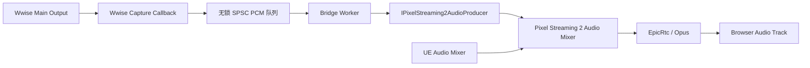

# WwisePixelStreaming2 实现方案

> 先提供Wwise Sink->Pixel Streaming2 Audio Input实现方案文档，不修改代码

<details><summary>10 previous messages</summary>

> 我先梳理仓库里 Pixel Streaming 2 的音频输入、WebRTC 音轨与现有 Sink 接口，确认方案能落在当前版本的实际扩展点上。此轮只输出实现方案，不会修改任何文件。
>
> <details><summary>Ran a command</summary>
>
> - Ran `Get-ChildItem -Force | Select-Object Mode,Length,LastWriteTime,Name; rg --files -g "AGENTS.md" -g "*.Build.cs" -g "*.Target.cs" -g "*.h" -g "*.cpp" -g "*.md" | Select-Object -First 300`
>
> </details>
>
> 当前仓库主要是 Pixel Streaming 的前端、信令与 SFU 基础设施，UE 插件源码不在根目录中；我会继续核对仓库版本、浏览器上行音频协议以及文档中对 Pixel Streaming 2 的约束。由于本机的快速搜索程序无法启动，我改用只读的文件检索完成调查。
>
> <details><summary>Ran 8 commands</summary>
>
> - Ran `git status --short; git branch --show-current; git log -1 --oneline; Get-Content RELEASE_VERSION; Get-Content README.md -TotalCount 120`
> - Ran `Get-ChildItem -Recurse -File -Include AGENTS.md,CLAUDE.md | Select-Object FullName; Get-ChildItem Docs -Recurse -File | Select-Object -First 150 FullName`
> - Ran `Get-ChildItem -Recurse -File -Include *.ts,*.tsx,*.js,*.md | Select-String -Pattern 'Audio Input|audio input|microphone|Microphone|Pixel Streaming 2|PixelStreaming2|send.*audio|audio.*send' | Select-Object -First 250 Path,LineNumber,Line`
> - Ran `$p='CLAUDE.md'; Write-Output ('FILE: '+$p); Select-String -Path $p -Pattern 'Audio|audio|Sink|sink|microphone|Microphone|Track|track|Producer|producer' -Context 3,6 | Select-Object -First 120 | ForEach-Object { $_.ToString() }`
> - Ran `$p='Docs\pixel-streaming-2-migration-guide.md'; Write-Output ('FILE: '+$p); Select-String -Path $p -Pattern 'Audio|audio|Sink|sink|microphone|Microphone|Track|track|Producer|producer' -Context 3,6 | Select-Object -First 120 | ForEach-Object { $_.ToString() }`
> - Ran `$p='Frontend\Docs\Using the Microphone Feature.md'; Write-Output ('FILE: '+$p); Select-String -Path $p -Pattern 'Audio|audio|Sink|sink|microphone|Microphone|Track|track|Producer|producer' -Context 3,6 | Select-Object -First 120 | ForEach-Object { $_.ToString() }`
> - Ran `$p='Frontend\library\src\PeerConnectionController\PeerConnectionController.ts'; Write-Output ('FILE: '+$p); Select-String -Path $p -Pattern 'Audio|audio|Sink|sink|microphone|Microphone|Track|track|Producer|producer' -Context 3,6 | Select-Object -First 120 | ForEach-Object { $_.ToString() }`
> - Ran `$p='Frontend\library\src\Config\Config.ts'; Write-Output ('FILE: '+$p); Select-String -Path $p -Pattern 'Audio|audio|Sink|sink|microphone|Microphone|Track|track|Producer|producer' -Context 3,6 | Select-Object -First 120 | ForEach-Object { $_.ToString() }`
>
> </details>
>
> 迁移文档已经确认关键方向：Pixel Streaming 2 将旧的 `IPixelStreamingAudioInput` 改名为 `IPixelStreaming2AudioProducer`，并由模块的 `CreateAudioProducer` 创建；因此 Wwise 的输出应接到 Producer，而不是接收浏览器音频用的 `IPixelStreaming2AudioSink`。我正在补齐准确的方法签名、线程与 PCM 格式要求，避免方案只停留在概念层。
>
> <details><summary>Ran 7 commands</summary>
>
> - Ran `git -c safe.directory=H:/YXK/YXK_UE_WP/YXK_PixelStreamingInfrastructure status --short; git -c safe.directory=H:/YXK/YXK_UE_WP/YXK_PixelStreamingInfrastructure branch --show-current; git -c safe.directory=H:/YXK/YXK_UE_WP/YXK_PixelStreamingInfrastructure log -1 --oneline`
> - Ran `Get-Content 'Frontend\Docs\Using the Microphone Feature.md'; $p='Frontend\library\src\PeerConnectionController\PeerConnectionController.ts'; $lines=Get-Content $p; for($i=500;$i -le 620;$i++){ '{0,5}: {1}' -f ($i+1),$lines[$i] }`
> - Ran `Get-ChildItem H:\YXK -Directory -Force | Select-Object FullName; Get-ChildItem H:\YXK\YXK_UE_WP -Directory -Force | Select-Object FullName`
> - Ran `Get-ChildItem H:\YXK -Directory -Force | Select-Object FullName; Get-ChildItem H:\YXK\YXK_UE_WP -Directory -Force | Select-Object FullName`
> - Ran `Get-Content 'Frontend\Docs\Using the Microphone Feature.md'; $p='Frontend\library\src\PeerConnectionController\PeerConnectionController.ts'; $lines=Get-Content $p; for($i=500;$i -le 620;$i++){ '{0,5}: {1}' -f ($i+1),$lines[$i] }`
> - Ran `$env:GIT_TEST_DEBUG_UNSAFE_DIRECTORIES='true'; git status --short; git branch --show-current; git log -1 --oneline`
> - Ran `Get-ChildItem H:\YXK\YXK_UE_WP\PixelStreamingDemo -Force | Select-Object Mode,Name,FullName; Get-ChildItem H:\YXK\YXK_UE_WP\PixelStreamingDemo -File -Filter *.uproject | ForEach-Object { Get-Content $_.FullName }; Get-ChildItem H:\YXK\YXK_UE_WP -Recurse -File -Include *.h,*.cpp,*.cs -ErrorAction SilentlyContinue | Select-String -Pattern 'IPixelStreaming2AudioProducer|CreateAudioProducer|IPixelStreamingAudioInput|PushAudio\(' | Select-Object -First 200 Path,LineNumber,Line`
>
> </details>
>
> 我还发现同一工作区下有 UE 示例工程，正在只读检索其中是否已经有 Wwise/Pixel Streaming 的桥接代码或对应引擎版本线索。若能找到实际头文件，文档会明确到类、生命周期和调用参数；找不到时我会把版本依赖标成实施前置确认项，不臆造签名。
>
> <details><summary>Ran 27 commands</summary>
>
> - Ran `Get-ChildItem H:\YXK\YXK_UE_WP\PixelStreamingDemo -Force | Select-Object Mode,Name,FullName; Get-ChildItem H:\YXK\YXK_UE_WP\PixelStreamingDemo -File -Filter *.uproject | ForEach-Object { Get-Content $_.FullName }`
> - Ran `Get-ChildItem H:\YXK\YXK_UE_WP -Directory | ForEach-Object { Get-ChildItem $_.FullName -File -Filter *.uproject -ErrorAction SilentlyContinue } | Select-Object FullName`
> - Ran `Get-ChildItem H:\YXK\YXK_UE_WP -Directory -Recurse -Filter '*Wwise*' -ErrorAction SilentlyContinue | Select-Object -First 100 FullName`
> - Ran `Get-ItemProperty 'HKCU:\Software\Epic Games\Unreal Engine\Builds' -ErrorAction SilentlyContinue | Format-List; Get-ChildItem 'C:\Program Files\Epic Games' -Directory -ErrorAction SilentlyContinue | Select-Object FullName; Get-ChildItem 'D:\Epic Games' -Directory -ErrorAction SilentlyContinue | Select-Object FullName; Get-ChildItem 'H:\Epic Games' -Directory -ErrorAction SilentlyContinue | Select-Object FullName`
> - Ran `Get-ChildItem 'C:\ProgramData\Epic\EpicGamesLauncher\Data\Manifests' -File -Filter *.item -ErrorAction SilentlyContinue | ForEach-Object { Select-String -Path $_.FullName -Pattern 'UE_5.7|InstallLocation|AppName' | ForEach-Object { $_.Line } }`
> - Ran `Get-ChildItem -Path 'H:\UE5\UE_5.7\Engine\Plugins\Media\PixelStreaming2\Source' -Recurse -File -Include *.h,*.cpp | Select-String -Pattern 'class.*IPixelStreaming2AudioProducer|struct.*IPixelStreaming2AudioProducer|CreateAudioProducer|PushAudio|IPixelStreaming2AudioProducer' | Select-Object Path,LineNumber,Line`
> - Ran `Write-Output 'FILE H:\UE5\UE_5.7\Engine\Plugins\Media\PixelStreaming2\Source\PixelStreaming2Core\Public\IPixelStreaming2AudioProducer.h'; Get-Content 'H:\UE5\UE_5.7\Engine\Plugins\Media\PixelStreaming2\Source\PixelStreaming2Core\Public\IPixelStreaming2AudioProducer.h'`
> - Ran `Write-Output 'FILE H:\UE5\UE_5.7\Engine\Plugins\Media\PixelStreaming2\Source\PixelStreaming2\Public\IPixelStreaming2Module.h'; Get-Content 'H:\UE5\UE_5.7\Engine\Plugins\Media\PixelStreaming2\Source\PixelStreaming2\Public\IPixelStreaming2Module.h'`
> - Ran `Write-Output 'FILE H:\UE5\UE_5.7\Engine\Plugins\Media\PixelStreaming2\Source\PixelStreaming2Core\Public\IPixelStreaming2Streamer.h'; Get-Content 'H:\UE5\UE_5.7\Engine\Plugins\Media\PixelStreaming2\Source\PixelStreaming2Core\Public\IPixelStreaming2Streamer.h'`
> - Ran `Write-Output 'FILE H:\UE5\UE_5.7\Engine\Plugins\Media\PixelStreaming2\Source\PixelStreaming2\Internal\AudioProducer.h'; Get-Content 'H:\UE5\UE_5.7\Engine\Plugins\Media\PixelStreaming2\Source\PixelStreaming2\Internal\AudioProducer.h'`
> - Ran `Write-Output 'FILE H:\UE5\UE_5.7\Engine\Plugins\Media\PixelStreaming2\Source\PixelStreaming2\Private\AudioProducer.cpp'; Get-Content 'H:\UE5\UE_5.7\Engine\Plugins\Media\PixelStreaming2\Source\PixelStreaming2\Private\AudioProducer.cpp'`
> - Ran `Write-Output 'FILE H:\UE5\UE_5.7\Engine\Plugins\Media\PixelStreaming2\Source\PixelStreaming2\Private\PixelStreaming2Module.cpp'; Get-Content 'H:\UE5\UE_5.7\Engine\Plugins\Media\PixelStreaming2\Source\PixelStreaming2\Private\PixelStreaming2Module.cpp'`
> - Ran `Get-ChildItem 'H:\UE5\UE_5.7\Engine' -Recurse -File -Include *.h,*.cpp -ErrorAction SilentlyContinue | Select-String -SimpleMatch ': public IPixelStreaming2AudioProducer' | Select-Object -First 100 Path,LineNumber,Line`
> - Ran `Get-ChildItem 'H:\YXK\YXK_UE_WP\yxk-ue5-pak-demo\Plugins\Wwise' -Recurse -File -Include AkSink.h,AkAudioBuffer.h,*.cpp,*.h -ErrorAction SilentlyContinue | Where-Object { $_.Name -eq 'AkSink.h' -or $_.FullName -match 'Sink' } | Select-Object -First 150 FullName`
> - Ran `Get-ChildItem 'H:\YXK\YXK_UE_WP\YXK_NiagaraForWwise' -Recurse -File -Include AkSink.h,AkAudioBuffer.h,*.cpp,*.h -ErrorAction SilentlyContinue | Where-Object { $_.Name -eq 'AkSink.h' -or $_.FullName -match 'Sink' } | Select-Object -First 150 FullName`
> - Ran `Get-ChildItem 'H:\YXK\YXK_UE_WP\yxk-ue5-pak-demo\Plugins\Wwise' -Depth 3 -Force | Select-Object -First 250 FullName`
> - Ran `Get-ChildItem 'H:\YXK\YXK_UE_WP\yxk-ue5-pak-demo\Plugins\Wwise' -Recurse -File -Filter AkSink.h -ErrorAction SilentlyContinue | Select-Object FullName; Get-ChildItem 'H:\YXK\YXK_UE_WP\yxk-ue5-pak-demo\Plugins\Wwise' -Recurse -File -Filter AkAudioBuffer.h -ErrorAction SilentlyContinue | Select-Object FullName; Select-String -Path 'H:\YXK\YXK_UE_WP\yxk-ue5-pak-demo\Plugins\Wwise\LauncherInfo.json' -Pattern 'Version|version'`
> - Ran `Get-Content 'H:\YXK\YXK_UE_WP\yxk-ue5-pak-demo\Plugins\Wwise\LauncherInfo.json'; Get-ChildItem 'H:\YXK\YXK_UE_WP\yxk-ue5-pak-demo\Plugins\Wwise\Source' -Recurse -File -Include *.cs | Select-String -Pattern 'ThirdParty|SDK|AkSink|WwiseVersion' | Select-Object -First 150 Path,LineNumber,Line`
> - Ran `Get-ChildItem 'G:\Wwise2025.1.4.9062\SDK' -Recurse -File -Filter AkSink.h -ErrorAction SilentlyContinue | Select-Object FullName; Get-ChildItem 'G:\Wwise2025.1.4.9062\SDK' -Recurse -File -Filter AkAudioBuffer.h -ErrorAction SilentlyContinue | Select-Object FullName; Get-ChildItem 'G:\Wwise2025.1.4.9062\SDK\samples' -Recurse -File -Include *Sink*.h,*Sink*.cpp -ErrorAction SilentlyContinue | Select-Object -First 100 FullName`
> - Ran `Test-Path 'G:\Wwise2025.1.4.9062\SDK'; Get-PSDrive -PSProvider FileSystem | Select-Object Name,Root`
> - Ran `Get-ChildItem 'G:\Wwise2025.1.4.9062\SDK\include\AK\Plugin' -File -ErrorAction SilentlyContinue | Where-Object { $_.Name -match 'Sink|AudioBuffer' } | Select-Object FullName; Get-ChildItem 'G:\Wwise2025.1.4.9062\SDK\include\AK' -Recurse -File -ErrorAction SilentlyContinue | Select-String -Pattern 'class IAkSinkPlugin|struct IAkSinkPlugin|IAkSinkPlugin' | Select-Object -First 50 Path,LineNumber,Line`
> - Ran `Get-ChildItem 'G:\Wwise2025.1.4.9062\SDK\include\AK' -Recurse -File -ErrorAction SilentlyContinue | Select-String -Pattern 'IAkSinkPlugin' | Select-Object -First 20 | ForEach-Object { '{0}:{1}: {2}' -f $_.Path,$_.LineNumber,$_.Line.Trim() }; Get-Content 'G:\Wwise2025.1.4.9062\SDK\include\AK\Plugin\AkSinkFactory.h'`
> - Ran `$p='G:\Wwise2025.1.4.9062\SDK\include\AK\SoundEngine\Common\IAkPlugin.h'; $l=Get-Content $p; for($i=1125;$i -le 1305;$i++){ '{0,5}: {1}' -f ($i+1),$l[$i] }; Get-ChildItem 'G:\Wwise2025.1.4.9062\SDK' -Recurse -File -Include *.h,*.cpp -ErrorAction SilentlyContinue | Select-String -Pattern 'class CAkSink|IAkSinkPluginBase|public IAkSinkPlugin' | Select-Object -First 50 | ForEach-Object { '{0}:{1}: {2}' -f $_.Path,$_.LineNumber,$_.Line.Trim() }`
> - Ran `Get-ChildItem 'G:\Wwise2025.1.4.9062\SDK' -Directory | Select-Object FullName; Get-ChildItem 'G:\Wwise2025.1.4.9062' -Recurse -File -Include AkSink.cpp,AkSink.h -ErrorAction SilentlyContinue | Select-Object -First 50 FullName`
> - Ran `Get-ChildItem 'G:\Wwise2025.1.4.9062\SDK\source' -Recurse -File -ErrorAction SilentlyContinue | Where-Object { $_.Name -match 'Sink' } | Select-Object -First 100 FullName; Get-ChildItem 'G:\Wwise2025.1.4.9062\SDK\source' -Depth 3 -ErrorAction SilentlyContinue | Select-Object -First 150 FullName`
> - Ran `Get-ChildItem 'H:\UE5\UE_5.7\Engine\Plugins\Media\PixelStreaming2\Source' -Recurse -File -Include *.h,*.cpp | Select-String -Pattern 'class FPatchInputProxy|OnNewAudioFrame\(' | ForEach-Object { '{0}:{1}: {2}' -f $_.Path,$_.LineNumber,$_.Line.Trim() }; Get-ChildItem 'H:\UE5\UE_5.7\Engine\Plugins\Media\PixelStreaming2\Source\PixelStreaming2' -File -Recurse -Include *.Build.cs | ForEach-Object { Get-Content $_.FullName }`
> - Ran `Get-Content 'H:\UE5\UE_5.7\Engine\Plugins\Media\PixelStreaming2\Source\PixelStreaming2\Internal\AudioCapturer.h'; Get-Content 'H:\UE5\UE_5.7\Engine\Plugins\Media\PixelStreaming2\Source\PixelStreaming2\Private\AudioCapturer.cpp'`
>
> </details>
>
> 已核对 UE 5.7 的实际源码：`CreateAudioProducer()` 虽仍在接口里，但已弃用且当前实现直接返回空指针；正确做法是自建 `IPixelStreaming2AudioProducer` 实现，再通过 `IPixelStreaming2Streamer::AddAudioProducer()` 注册。另有一个必须写进方案的版本细节：公开注释把 `NumSamples` 描述成“每声道帧数”，但 5.7 内部实际按“交错后的总标量样本数”处理，实施时应传 `ValidFrames × Channels` 并用测试锁定该行为。
>
> <details><summary>Ran 17 commands</summary>
>
> - Ran `Get-ChildItem 'G:\Wwise2025.1.4.9062\SDK\include\AK' -Recurse -File | Select-String -Pattern 'struct AkAudioBuffer|class AkAudioBuffer' | Select-Object -First 20 | ForEach-Object { '{0}:{1}: {2}' -f $_.Path,$_.LineNumber,$_.Line.Trim() }; Get-ChildItem 'G:\Wwise2025.1.4.9062\SDK\include\AK' -Recurse -File | Select-String -Pattern 'GetChannel\(' | Select-Object -First 30 | ForEach-Object { '{0}:{1}: {2}' -f $_.Path,$_.LineNumber,$_.Line.Trim() }`
> - Ran `$p='G:\Wwise2025.1.4.9062\SDK\include\AK\SoundEngine\Common\AkCommonDefs.h'; $l=Get-Content $p; for($i=300;$i -le 470;$i++){ '{0,5}: {1}' -f ($i+1),$l[$i] }; Get-ChildItem 'G:\Wwise2025.1.4.9062\SDK\include\AK' -Recurse -File | Select-String -Pattern 'struct AkAudioFormat|class AkAudioFormat' | Select-Object -First 10 | ForEach-Object { '{0}:{1}' -f $_.Path,$_.LineNumber }`
> - Ran `$p='G:\Wwise2025.1.4.9062\SDK\include\AK\SoundEngine\Common\AkCommonDefs.h'; $l=Get-Content $p; for($i=50;$i -le 120;$i++){ '{0,5}: {1}' -f ($i+1),$l[$i] }`
> - Ran `Get-ChildItem 'G:\Wwise2025.1.4.9062\SDK\include\AK\SoundEngine\Common' -File | Select-String -Pattern 'AddOutput\(' | Select-Object -First 20 | ForEach-Object { '{0}:{1}: {2}' -f $_.Path,$_.LineNumber,$_.Line.Trim() }; Get-ChildItem 'G:\Wwise2025.1.4.9062\SDK\include\AK\SoundEngine\Common' -File | Select-String -Pattern 'struct AkOutputSettings' | Select-Object -First 10 | ForEach-Object { '{0}:{1}' -f $_.Path,$_.LineNumber }`
> - Ran `$p='G:\Wwise2025.1.4.9062\SDK\include\AK\SoundEngine\Common\AkSoundEngine.h'; $l=Get-Content $p; for($i=4470;$i -le 4640;$i++){ '{0,5}: {1}' -f ($i+1),$l[$i] }; $p2='G:\Wwise2025.1.4.9062\SDK\include\AK\SoundEngine\Common\AkSoundEngineTypes.h'; $l2=Get-Content $p2; for($i=200;$i -le 255;$i++){ '{0,5}: {1}' -f ($i+1),$l2[$i] }`
> - Ran `Get-ChildItem 'G:\Wwise2025.1.4.9062\SDK\include\AK' -Recurse -File | Select-String -Pattern 'AkCaptureCallbackFunc' | ForEach-Object { '{0}:{1}: {2}' -f $_.Path,$_.LineNumber,$_.Line.Trim() }`
> - Ran `$p='G:\Wwise2025.1.4.9062\SDK\include\AK\SoundEngine\Common\AkCallbackTypes.h'; $l=Get-Content $p; for($i=435;$i -le 475;$i++){ '{0,5}: {1}' -f ($i+1),$l[$i] }`
> - Ran `Get-ChildItem 'H:\YXK\YXK_UE_WP\yxk-ue5-pak-demo\Plugins\Wwise\Source\AkAudio' -Recurse -File -Include *.h,*.cpp | Select-String -Pattern 'On.*Initialized|IsInitialized\(|AkAudioDevice.*Delegate|OnAkAudioDevice|AudioDeviceCreated|OnSoundEngine' | Select-Object -First 200 | ForEach-Object { '{0}:{1}: {2}' -f $_.Path,$_.LineNumber,$_.Line.Trim() }`
> - Ran `Get-Content 'H:\YXK\YXK_UE_WP\yxk-ue5-pak-demo\Plugins\Wwise\Source\AkAudio\Public\AkAudioModule.h'; $p='H:\YXK\YXK_UE_WP\yxk-ue5-pak-demo\Plugins\Wwise\Source\AkAudio\Public\AkAudioDevice.h'; $l=Get-Content $p; for($i=75;$i -le 110;$i++){ '{0,5}: {1}' -f ($i+1),$l[$i] }; for($i=905;$i -le 970;$i++){ '{0,5}: {1}' -f ($i+1),$l[$i] }`
> - Ran `Get-Content 'H:\YXK\YXK_UE_WP\yxk-ue5-pak-demo\Plugins\Wwise\Wwise.uplugin' | Select-String -Pattern 'AkAudio|LoadingPhase|Name' -Context 0,2; Get-Content 'H:\UE5\UE_5.7\Engine\Plugins\Media\PixelStreaming2\PixelStreaming2.uplugin' | Select-String -Pattern 'PixelStreaming2|LoadingPhase|Name' -Context 0,2`
> - Ran `Get-ChildItem 'G:\Wwise2025.1.4.9062\SDK\include\AK' -Recurse -File | Select-String -Pattern 'uNumSamplesPerFrame|GetMaxBufferLength' | Select-Object -First 50 | ForEach-Object { '{0}:{1}: {2}' -f $_.Path,$_.LineNumber,$_.Line.Trim() }`
> - Ran `$p='H:\UE5\UE_5.7\Engine\Plugins\Media\PixelStreaming2\Source\PixelStreaming2Core\Private\Streamer.cpp'; Select-String -Path $p -Pattern 'AddAudioProducer|RemoveAudioProducer|GetAudioProducers' -Context 3,8 | ForEach-Object { $_.ToString() }`
> - Ran `Get-ChildItem 'H:\UE5\UE_5.7\Engine\Plugins\Media\PixelStreaming2\Source' -Recurse -File -Include *.cpp,*.h | Select-String -Pattern 'void .*AddAudioProducer|AddAudioProducer\(TSharedPtr' | ForEach-Object { '{0}:{1}: {2}' -f $_.Path,$_.LineNumber,$_.Line.Trim() }`
> - Ran `$p='H:\UE5\UE_5.7\Engine\Plugins\Media\PixelStreaming2\Source\PixelStreaming2RTC\Private\EpicRtcStreamer.cpp'; $l=Get-Content $p; for($i=175;$i -le 235;$i++){ '{0,5}: {1}' -f ($i+1),$l[$i] }`
> - Ran `Select-String -Path 'H:\UE5\UE_5.7\Engine\Plugins\Media\PixelStreaming2\Source\PixelStreaming2RTC\Private\EpicRtcStreamer.cpp' -Pattern 'AudioCapturer' -Context 3,7 | Select-Object -First 80 | ForEach-Object {$_.ToString()}`
> - Ran `Get-ChildItem 'H:\YXK\YXK_UE_WP\yxk-ue5-pak-demo\Plugins\Wwise\Source' -Recurse -File -Include *.h,*.cpp | Select-String -Pattern 'RegisterCaptureCallback|UnregisterCaptureCallback' | ForEach-Object { '{0}:{1}: {2}' -f $_.Path,$_.LineNumber,$_.Line.Trim() }; Get-ChildItem 'H:\YXK\YXK_UE_WP\yxk-ue5-pak-demo\Plugins\Wwise\Source' -Recurse -File -Include *.h,*.cpp | Select-String -Pattern 'GetSoundEngine\(\)|FWwiseSoundEngineAPI::Get|IWwiseSoundEngineAPI' | Select-Object -First 80 | ForEach-Object { '{0}:{1}: {2}' -f $_.Path,$_.LineNumber,$_.Line.Trim() }`
> - Ran `$p='H:\YXK\YXK_UE_WP\yxk-ue5-pak-demo\Plugins\Wwise\Source\AkAudio\Public\AkAudioDevice.h'; $l=Get-Content $p; for($i=975;$i -le 1005;$i++){ '{0,5}: {1}' -f ($i+1),$l[$i] }`
>
> </details>
</details>

以下方案基于本机实际安装的 **UE 5.7 + Wwise 2025.1.4.9062** 源码核对完成。本轮未修改任何文件。

# Wwise Sink -> Pixel Streaming 2 Audio Input 实现方案

## 1. 目标

将 Wwise 最终输出混音发送到 Pixel Streaming 2，使浏览器通过现有 WebRTC 音轨听到 Wwise 音频。

本方案不包含浏览器麦克风到 Wwise 的反向链路，也不需要修改当前 Pixel Streaming Infrastructure 的前端、信令服务器或 SFU。

## 2. 术语与方向

这里的 Pixel Streaming 2 Audio Input 指“送入流媒体编码管线的音频 Producer”，不是浏览器麦克风输入。

正确的数据方向为：



`IPixelStreaming2AudioSink` 用于接收浏览器上行音频，不适用于本需求。迁移关系可见 [Pixel Streaming 2 migration guide](./Docs/pixel-streaming-2-migration-guide.md:41)。

## 3. 推荐实现

### 3.1 使用 Wwise Capture Callback，不开发自定义 Sink 插件

Wwise 2025.1.4 的 `FAkAudioDevice` 已公开：

- `RegisterCaptureCallback`
- `UnregisterCaptureCallback`

接口见 [AkAudioDevice.h](H:/YXK/YXK_UE_WP/yxk-ue5-pak-demo/Plugins/Wwise/Source/AkAudio/Public/AkAudioDevice.h:983)。

底层回调提供 Wwise 输出设备的最终混音缓冲区，并明确保证数据为 **float32、interleaved**，见 [AkCallbackTypes.h](G:/Wwise2025.1.4.9062/SDK/include/AK/SoundEngine/Common/AkCallbackTypes.h:445)。

这比实现 `IAkSinkPlugin` 更合适：

- 不替换系统主输出，扬声器仍正常播放。
- 不需要 Wwise Authoring 插件、独立平台库及音频时钟实现。
- 可以通过 `AkOutputDeviceID` 选择主输出或指定的 Secondary Output。
- 获取到的格式与 Pixel Streaming 2 Producer 所需的 float PCM 基本一致。

只有目标 Wwise 版本没有 Capture Callback，或者必须实现完全独立的网络 Audio Device 时，才采用自定义 `IAkSinkPlugin` 作为备选方案。

### 3.2 Pixel Streaming 2 Producer

创建一个项目级运行时插件，例如 `WwisePixelStreaming2Bridge`。插件内部自建并持有一个 `IPixelStreaming2AudioProducer` 实例，将其注册到目标 Streamer：

```cpp
Streamer->AddAudioProducer(AudioProducer);
```

不要调用 `IPixelStreaming2Module::CreateAudioProducer()`。在 UE 5.7 中该函数已经弃用，并且实际实现直接返回空指针，见 [IPixelStreaming2Module.h](H:/UE5/UE_5.7/Engine/Plugins/Media/PixelStreaming2/Source/PixelStreaming2/Public/IPixelStreaming2Module.h:86) 和 [PixelStreaming2Module.cpp](H:/UE5/UE_5.7/Engine/Plugins/Media/PixelStreaming2/Source/PixelStreaming2/Private/PixelStreaming2Module.cpp:176)。

Streamer 的正式扩展入口见 [IPixelStreaming2Streamer.h](H:/UE5/UE_5.7/Engine/Plugins/Media/PixelStreaming2/Source/PixelStreaming2Core/Public/IPixelStreaming2Streamer.h:66)。

## 4. 线程模型

Wwise Capture Callback 在 Wwise 实时音频线程执行，不能在回调中直接调用 `PushAudio()`。

原因是 UE 5.7 的 Pixel Streaming 2 会在 `PushAudio()` 的同步调用链中进行数组分配、复制、重采样和声道转换。直接调用可能造成 Wwise voice starvation。

推荐处理：

1. 启动时预分配 8 个固定 PCM Slot，每个支持最多 2048 帧和约定的最大声道数。
2. Wwise 回调只执行边界检查、PCM 复制、原子入队和唤醒 Worker。
3. 独立 Worker 从 SPSC 队列取出 PCM，再调用 Producer。
4. 队列满时丢弃最新帧并增加计数，绝不阻塞 Wwise 音频线程。
5. 回调内禁止日志、动态分配、锁、重采样和声道转换。

核心调用逻辑为：

```cpp
// Wwise callback: CaptureBuffer 已经是 float interleaved
Queue.TryPush(
    CaptureBuffer.GetInterleavedData(),
    CaptureBuffer.uValidFrames,
    CaptureBuffer.NumChannels());

// Worker
Producer->PushAudio(
    Slot.Data,
    Slot.ValidFrames * Slot.NumChannels,
    Slot.NumChannels,
    WwiseSampleRate);
```

## 5. PCM 格式约定

建议 Wwise 使用 48 kHz、Stereo 输出，以减少转换和带宽前处理。

Pixel Streaming 2 内部可以处理采样率转换和声道转换，因此也可传入 44.1 kHz 或多声道 PCM。最终会混入默认的 48 kHz 双声道 WebRTC 音频管线。

需要特别注意 UE 5.7 的实现差异：

- 公共头文件把 `NumSamples` 注释成“单声道帧数”。
- 实际内部代码按“所有声道交错后的总样本数”处理。
- 因此 UE 5.7 必须传 `ValidFrames × NumChannels`。

相关实现见 [IPixelStreaming2AudioProducer.h](H:/UE5/UE_5.7/Engine/Plugins/Media/PixelStreaming2/Source/PixelStreaming2Core/Public/IPixelStreaming2AudioProducer.h:28) 和 [AudioCapturer.cpp](H:/UE5/UE_5.7/Engine/Plugins/Media/PixelStreaming2/Source/PixelStreaming2/Private/AudioCapturer.cpp:53)。该行为应由自动化测试锁定，升级 UE 后重新验证。

## 6. 生命周期

启动顺序：

1. 创建队列、Worker 和 Audio Producer。
2. 等待 Wwise SoundEngine 初始化，然后注册 Capture Callback。
3. 等待 Pixel Streaming 2 就绪。
4. 按配置的 Streamer ID 查找 Streamer，并调用 `AddAudioProducer()`。
5. 如果 Streamer 尚未创建，则按 Tick 延迟重试，不主动创建 Streamer。

不能只在 `IPixelStreaming2Module::OnReady()` 中立即查找默认 Streamer，因为 UE 5.7 实际上先广播 Ready，再创建默认 Streamer。

关闭顺序：

1. 原子关闭回调接收开关。
2. 调用 `UnregisterCaptureCallback()`。
3. 等待已经进入的回调退出。
4. 停止并 Join Worker。
5. 从 Streamer 调用 `RemoveAudioProducer()`。
6. 最后释放 Producer、队列和回调 Cookie。

## 7. 配置项

运行时插件建议提供以下配置：

| 配置 | 默认值 | 作用 |
|---|---:|---|
| `Enabled` | `true` | 启用桥接 |
| `StreamerId` | Pixel Streaming 默认 ID | 目标 Streamer |
| `OutputDeviceId` | 主输出 | 指定 Wwise 输出 |
| `QueueSlots` | `8` | 缓冲帧数量 |
| `MaxChannels` | `8` 或 `16` | 最大输入声道数 |
| `Gain` | `1.0` | 进入 Pixel Streaming 前增益 |
| `SendSilence` | `true` | 无有效 PCM 时维持连续音频时钟 |

## 8. 重复音频风险

Pixel Streaming 2 会自动采集 UE Audio Mixer，同时把自定义 Producer 混入相同管线。

如果项目已经通过 Wwise AudioLink 或其他方式把 Wwise 输出送入 UE Audio Mixer，再启用本桥接会产生重复音频或梳状滤波。验收前必须确认 Wwise 当前是直接输出到系统设备，还是已经回流 UE Audio Mixer；两条路径只能保留一条。

## 9. 前端影响

浏览器端无需启用 `UseMic`。没有麦克风时，当前前端仍会创建 `recvonly` audio transceiver，见 [PeerConnectionController.ts](./Frontend/library/src/PeerConnectionController/PeerConnectionController.ts:519)。

因此不需要修改：

- Pixel Streaming Frontend
- Signalling Web Server
- SFU
- SDP 或音频 Codec 配置

## 10. 验收标准

- 只播放 Wwise Event、关闭 UE 原生声音时，浏览器可听到音频。
- 左右声道测试音方向正确，无交错格式错误。
- Wwise 48 kHz Stereo 连续播放 30 分钟，无爆音、累积延迟和明显丢帧。
- 浏览器断开重连、Pixel Streaming Stop/Start 后音频恢复。
- PIE 重启和 Packaged 退出过程中无悬空回调或崩溃。
- 人为阻塞 Worker 时只增加丢帧计数，不造成 Wwise starvation。
- Wwise 静音时 WebRTC 音轨保持有效。
- 确认不存在 Wwise AudioLink 与自定义 Producer 双重采集。

## 11. 实施结论

基准方案为：

**Wwise `RegisterCaptureCallback` → 预分配 SPSC Queue → Worker → 自建 `IPixelStreaming2AudioProducer` → `Streamer::AddAudioProducer()`。**

实现代码应放在目标 UE 工程的独立 Runtime Plugin 中，而不是当前 Pixel Streaming Infrastructure 仓库。当前仓库只负责浏览器、信令和 SFU，不包含 UE/Wwise C++ 插件源码。
